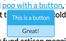
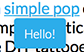

# Moo.PopBubble
A simple, light-weight contextual menu for links that supports buttons and forms.

# How to use
- Add `` at the bottom of your page (remember to load MooTools 1.5.2 or higher *before* adding this tag).
- For simple text bubbles add `class="popBubble"` to your links and `data-pop-text` attribute with your message text (see *pop-sample.html*).
- For bubbles with a link button also add `data-pop-button` attribute with the text that you want to appear in your bubble's buttom (yes it does **support JavaScript functions**).
- For bubbles with simple input forms you will need:
  1. Have `class="popBubble"` and `data-pop-text` attribute in place within your links as well as `data-pop-form` attribute with an ID of your form (see below)
  2. You will also need to actually create the form within your html with the same ID as in the `data-pop-form` attribute in your link. *Note that currently the script and CSS in this plugin (or app, if you wish) only supports simple forms with a single button and a single text-input field*
  
  -
  And that's pretty much it. Feel free to use however you wish and contribute your code if you like.
